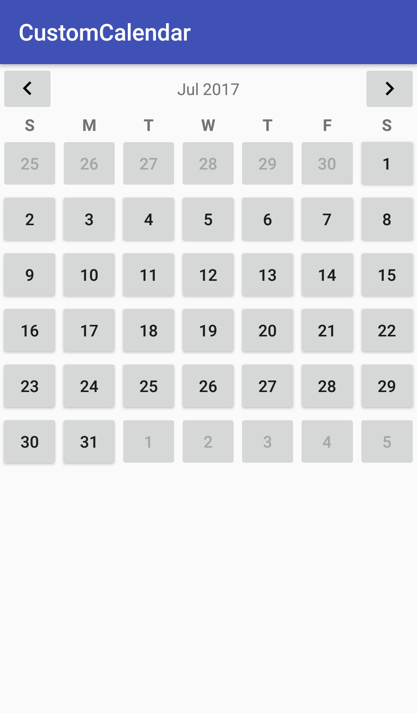
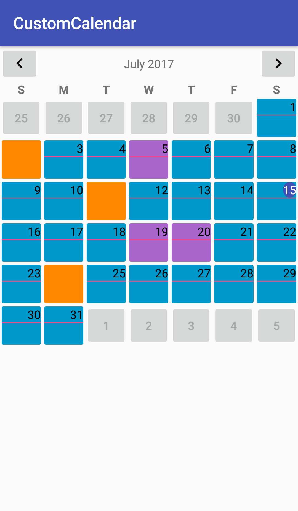

# zcustomcalendar
Custom calendar for Android.
## How it works
Date --> Description --> Property.

A date is linked to a description (of your choice). Each description is linked to a Property object (of your choice) which contains the resource id of the layout that should be inflated for a date of this description. It also contains the resource id of a `TextView` within the view that should be used to display the date. It also contains a boolean field which tells whether a date of this description should be enabled or not.

Using this model, you can customize your entire calendar with your own custom views. The possibilities are endless: from displaying a simple button to displaying a list of events within the same date view!

## Getting started
Get a cookbook example from the 'app' folder. All the code snippets shown below are from the example in the 'app' folder. This example is just for illustration purposes. You can customize your calendar to whichever extent you wish.

1) **Import this library to your project:** Include the following line in your app's build.gradle
```
dependencies {
  .
  .
  .
  compile 'org.naishadhparmar.zcustomcalendar:zcustomcalendar:1.0.1'
}
```

2) **Include the view in your activity:**
```
    <org.naishadhparmar.zcustomcalendar.CustomCalendar
        android:id="@+id/custom_calendar" (id of your choice)
        android:layout_width="match_parent"
        android:layout_height="wrap_content"/>
```
This will show the plain vanilla calendar.



Add this line to the parent tag of your layout
```
xmlns:app="http://schemas.android.com/apk/res-auto"
```
and then customize it
```
    <org.naishadhparmar.zcustomcalendar.CustomCalendar
        android:id="@+id/custom_calendar"
        android:layout_width="match_parent"
        android:layout_height="wrap_content"
        app:day_of_week_length="1" (length of your choice, default 1)
        app:day_of_week_start_from="sunday" (any from sunday to saturday, default sunday)
        app:month_year_format="full_month__with_year" (either full_month__with_year or three_letter_month__with_year, default three_letter_month__with_year)
        app:row_height="50dp" (height of your choice, default WRAP_CONTENT)
        app:left_button_src="@drawable/ic_keyboard_arrow_left_black_24dp" (drawable of your choice, default ic_keyboard_arrow_left_black_24dp included in the library, downloaded from material.io)
        app:right_button_src="@drawable/ic_keyboard_arrow_right_black_24dp" (drawable of your choice, default ic_keyboard_arrow_right_black_24dp included in the library, downloaded from material.io)
    />
```

3) **Initialize the custom calendar in your Activity:**
```
CustomCalendar customCalendar = (CustomCalendar) findViewById(R.id.custom_calendar);
```

4) **Decide which states (descriptions) your calendar will have:** In the example above, I am taking the descriptions 'default', 'unavailable' and 'holiday'. For each of these states a custom view should be defined. Suppose the views are named `default_view.xml`, `unavailable_view.xml` and `holiday_view.xml`. (source code in the 'app' folder)

Initialize a map linking description to property
```
    HashMap<Object, Property> mapDescToProp = new HashMap<>();

    Property propDefault = new Property();
    propDefault.layoutResource = R.layout.default_view;
    propDefault.dateTextViewResource = R.id.default_datetextview;
    mapDescToProp.put("default", propDefault);

    Property propUnavailable = new Property();
    propUnavailable.layoutResource = R.layout.unavailable_view;
    //You can leave the text view field blank. Custom calendar won't try to set a date on such views
    propUnavailable.enable = false;
    mapDescToProp.put("unavailable", propUnavailable);

    Property propHoliday = new Property();
    propHoliday.layoutResource = R.layout.holiday_view;
    propHoliday.dateTextViewResource = R.id.holiday_datetextview;
    mapDescToProp.put("holiday", propHoliday);

    customCalendar.setMapDescToProp(mapDescToProp);		
```
Initialize a map linking date to description
```
     HashMap<Integer, Object> mapDateToDesc = new HashMap<>();
     Calendar calendar = Calendar.getInstance();
     mapDateToDesc.put(2, "unavailable");
     mapDateToDesc.put(5, "holiday");
     mapDateToDesc.put(10, "default"); //You don't need to explicitly mention "default" description dates.
     mapDateToDesc.put(11, "unavailable");
     mapDateToDesc.put(19, "holiday");
     mapDateToDesc.put(20, "holiday");
     mapDateToDesc.put(24, "unavailable");
     customCalendar.setDate(calendar, mapDateToDesc);
```
Dates with the description “default” do not need to be explicitly mentioned. If no description is linked with a date, “default” property will be applied to that date.

5) **Implement the navigation button listener:** When a navigation button is clicked, you might want to send back a map linking dates in the new month to their descriptions. The `OnNavigationButtonClickedListener` does just that.
```
public class ActivityMain extends AppCompatActivity implements OnNavigationButtonClickedListener {
    .
    .
    .
    
    @Override
    public Map<Integer, Object>[] onNavigationButtonClicked(int whichButton, Calendar newMonth) {
        Map<Integer, Object>[] arr = new Map[2];
        switch(newMonth.get(Calendar.MONTH)) {
        case Calendar.AUGUST:
            arr[0] = new HashMap<>(); //This is the map linking a date to its description
            arr[0].put(3, "unavailable");
            arr[0].put(6, "holiday");
            arr[0].put(21, "unavailable");
            arr[0].put(24, "holiday");
            arr[1] = null; //Optional: This is the map linking a date to its tag.
            break;
        case Calendar.JUNE:
            arr[0] = new HashMap<>();
            arr[0].put(5, "unavailable");
            arr[0].put(10, "holiday");
            arr[0].put(19, "holiday");
            break;
        }
        return arr;
    }
}
```

Set the listeners
```
  customCalendar.setOnNavigationButtonClickedListener(CustomCalendar.PREVIOUS, this);
  customCalendar.setOnNavigationButtonClickedListener(CustomCalendar.NEXT, this);
```

6) **Implement a date selected listener:** This will be called every time the user clicks on a date.
```
    customCalendar.setOnDateSelectedListener(new OnDateSelectedListener() {
      @Override
      public void onDateSelected(View view, Calendar selectedDate, Object desc) {
          Snackbar.make(customCalendar, selectedDate.get(Calendar.DAY_OF_MONTH) + " selected", Snackbar.LENGTH_LONG).show();
       }
    });
```
**You are all set!**



## Some other features
- You can pass a map linking a date to a tag (of type `Object`). The date view of that date will be given that tag. This tag will be available from the view object in the `onDateSelected(View, Calendar, Object)` method of the `OnDateSelectedListener`.
- The previous and next month date views shown in the current month for continuity can also be modified. In the description to property map, put an entry with the key as "disabled" and its respective property as its value.

## One downside
Currently, there is no animation in moving from one month to another. I am working on that.

## If you are feeling too experimenty!
- You can call `getAllViews()` on the custom calendar to get an array of all the date views for that month. You can twist them and tweak them however much you like.
- You can also call `getMonthYearTextView()` on the custom calendar to get the text view that displays the month and the year. You can change it as per your requirements.

## Disclaimer
The previous and next month button images were downloaded from https://material.io/icons/ into the resources folder of this library. I do not own these images, all rights are reserved by the respective owners.

## Developer
@naishadhparmar: Naishadh Parmar. Just out of high school.
